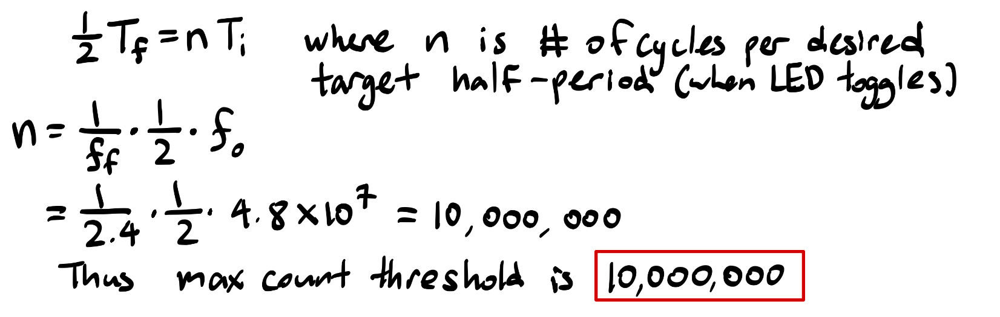
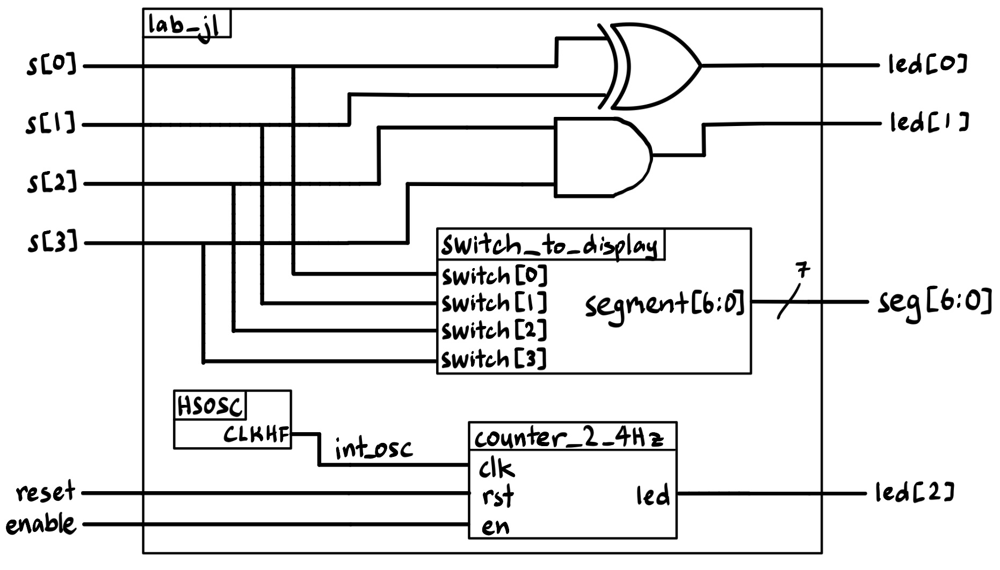
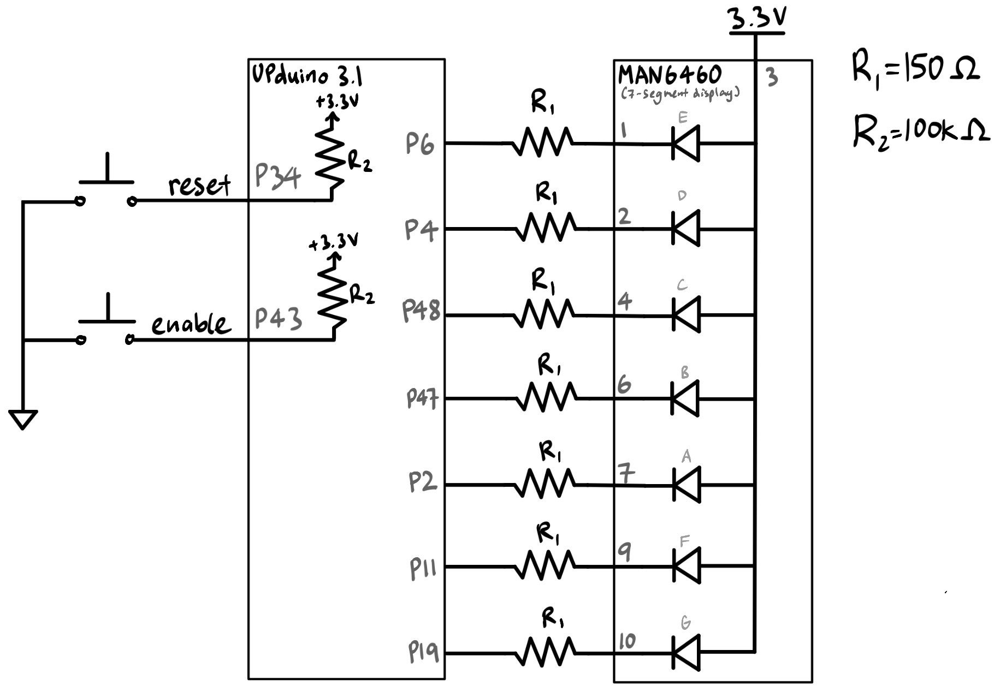
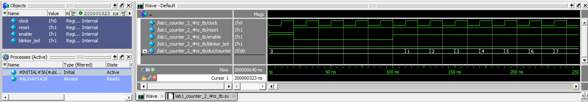
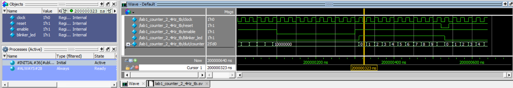
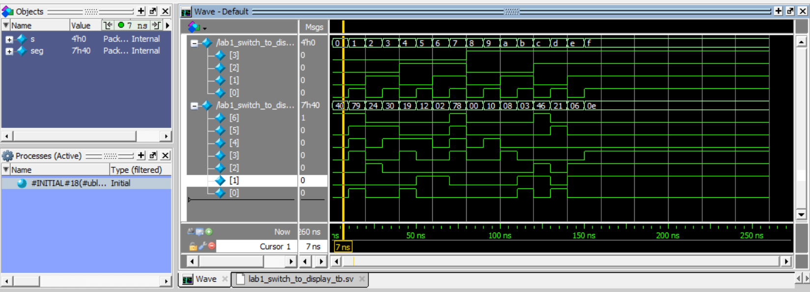
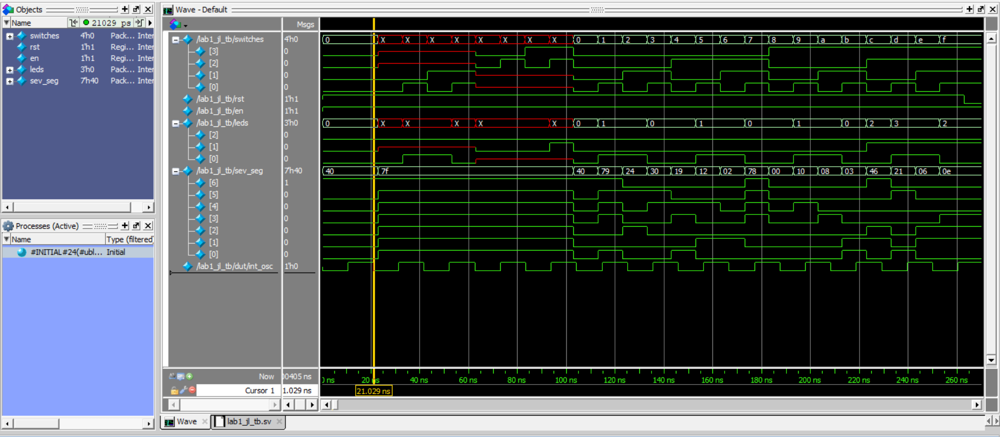
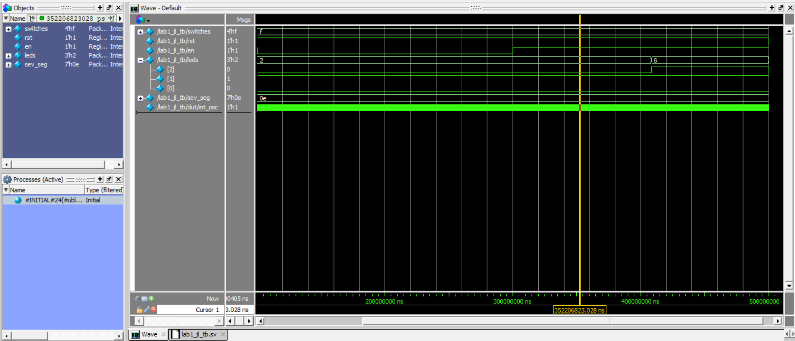
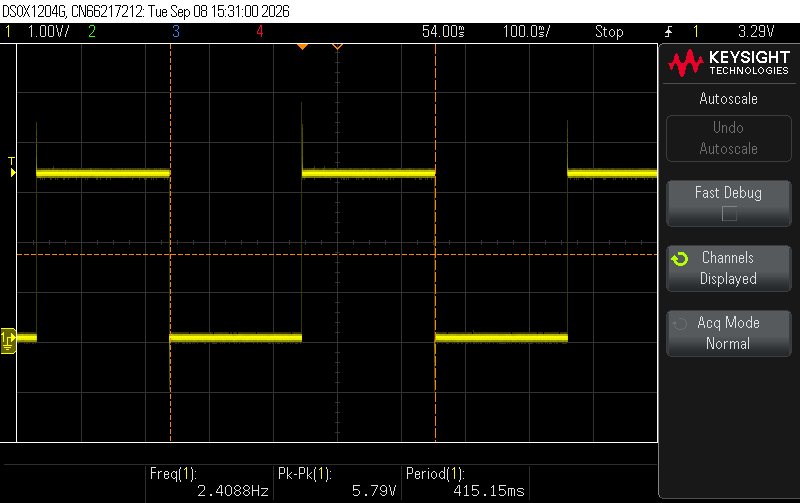
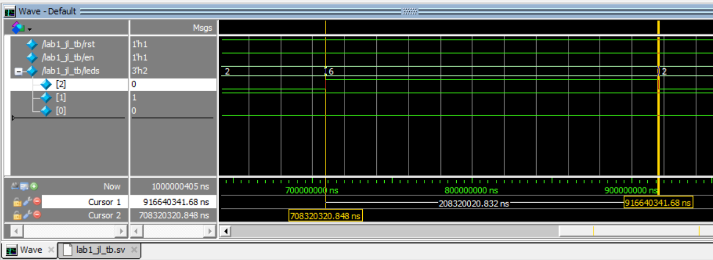

## Introduction

In this lab, the E155 course development pcb board was assembled and tested. Once functionally validated, a design was implemented on the FPGA 
with the following features:

* A 7-segment display that shows the hexadecimal digit corresponding to a 4 bit binary number.

  + The digit displayed is controlled by 4 switches on the development board, which map out the 4 bit binary number.

* LED 1 and LED 2 on the development board light up according to a given look-up table, dependent on the input of the same 4 switches.

* LED 3 blinks at a frequency of ~2.4 Hz.

  + A reset button and an enable button are both implemented for this blinker LED.

## Design and Testing Methodology

The design uses a total of 3 modules:

* lab1_jl.sv (the top module)

  + the on-board high speed oscillator (`HSOSC`) was used to generate a signal at 48 MHz

  + the switch-to-LED logic was assigned [combinational logic].

  + used 2 submodules:

    - counter_2_4Hz.sv [sequential logic]: simple clock divider that converts the 48 Mhz `HSOSC` signal to a 2.4Hz signal. Implemented enable and reset.

    - switch_to_display.sv [combinational logic]: contained the logic for the switch input to seven segment display output.

  
The submodule counter_2_4Hz.sv uses a simple counter to divide the 48 MHz clock signal down to 2.4 Hz. The maximum count threshold was calculated as follows:

::: {.callout-note collapse="false"}
## 2.4 Hz Counter Submodule: Calculations for Max Count Threshold
{#fig-maxCounerCalcs}
:::

## Technical Documentation:

The code for this project can be found in this [Github repository](https://github.com/jesli12/e155-lab1).

### Block Diagram

::: {.callout-note collapse="false"}
## Block Diagram
{#fig-block}
::: 

The block diagram in @fig-block demonstrates the overall architecture of the design. 

### Schematic

::: {.callout-note collapse="false"}
## Schematic
{#fig-schematic}

Schematic of the physical circuit. Note that the 7-segment display (MAN6460) is a common anode display, so the segments are active low. 
:::

@fig-schematic shows the physical layout of the design.
Internal 100 k$\Omega$ pullup resistors were used to ensure the active low was not floating for the buttons and the 4 switch inputs.
Each segment in the 7-segment display was connected using a 150 $\Omega$ current-limiting resistor to ensure that it stays within recommended operating conditions. Calculations for the current-limiting resistors for the common anode 7-segment display are shown below.

::: {.callout-note collapse="false"}
## Calculations for Current-Limiting Resistors for 7-segment Display
$$
I_D=\frac{V_{DD}-V_{ON}}{R_S+R_D}
$$

We can assume $R_S$ (internal resistance)to be negligible. The voltage provided by the development board is $V_{DD}$ = 3.3 V, and $V_{ON}$ = 2.1 V according to the 7-segment display datasheet. $I_D = 8$ mA was chosen as it falls within the ideal range of 5-20 mA and results in a standard $R_D$ value.

Solving the equation results in a resistor value of 150 $\Omega$.

:::

## Results and Discussion

All prescribed tasks and specifications were met. Thorough verification can be found below.

### Testbench Simulation

For verification, one testbench was written for each of the 3 modules. 
Below are the QuestaSim simulations.

## Counter Submodule Tests: Counter_2_4Hz

::: {.callout-note collapse="true"}
## Counter Testbench QuestaSim Results
{#fig-counterTBtest1a}

This first waveform validates that reset and enable work as intended for the counter. The waveform shows that when reset is asserted (active low), the counter resets to 0. When enable is turned off (active high), the counter freezes at its current value. Other scenarios are tested in the following frame in the waveforms.

{#fig-counterTBtests}

This frame in the waveform validates that the counter is counting as expected, when it reaches the maximum count threshold, it resets to 0, toggles the LED, and starts counting again. Enable is turned off once it reaches the maximum count to demonstrate that the counter can be frozen at a non-zero value as well. Finally, reset is tested to show that the counter and LED can be set back to 0 (starting from non-zero values)
:::

## 7-segment Submodule Tests: switch_to_display

::: {.callout-note collapse="true"}
## 7-segment Display Testbench QuestaSim Results
{#fig-sevSegTB}

The waveform shows that the 7-segment display is displaying the correct hexadecimal digit based on the input from the 4 switches. (Note that the 7-segment display (MAN6460) is a common anode display, so the segments are active low.)
:::

## Top Module Tests: lab1_jl

::: {.callout-note collapse="true"}
## Top Module Testbench QuestaSim Results
{#fig-topModTests13a}

{#fig-topModTest3b}

First, the cursor shows that the `HSOCS` is accurately generating a 48 MHz clock signal. The first cycle ends roughly at 20.029 ns, and the period for a 48 MHz signal is 20.833 ns. This shows that the top module is correctly connected to the `HSOSC` primitive.

The waveform also shows that LED 1 and LED 2 are lighting up according to the given look-up table based on the input from the 4 switches.

The waveform shows that the 7-segment display is displaying the correct hexadecimal digit based on the input from the 4 switches. This shows that the top module is correctly connected to the `switch_to_display` submodule. (Note that the 7-segment display (MAN6460) is a common anode display, so the segments are active low.)

Finally, the waveform shows that enable and reset work as intended for the blinker LED[2]. This shows that the top module is correctly connected to the `counter_2_4Hz` submodule.
:::

::: {.callout-note collapse="true"}
## Verifying 2.4 Hz Blinker LED
{#fig-oscope}

The oscilloscope screenshot in @fig-oscope confirms that the blinker LED is toggling at the expected frequency of 2.4 Hz.

{#fig-topModTestBlinker}

This was also confirmed in the QuestaSim simulation of the top module, as shown in @fig-topModTestBlinker. The waveform shows a completed half-cycle of the blinker LED (roughly 208333333 ns), which is consistent with the expected behavior of a 2.4 Hz blinking LED.
:::

The design met all intended design objectives.

## Conclusion

As demonstrated above, the design successfully completed its functions. It was able to blink an on-board LED at 2.4 Hz, display the correct hexadecimal digit on a 7-segment display based on the input from 4 switches, and light up two other LEDs according to a given look-up table.

I spent roughly a total of 40 hours working on this lab and report.

## AI Prototype Summary

::: {.callout-note title="LLM Prompt" collapse="true"}
"Write SystemVerilog HDL to leverage the internal high speed oscillator in the Lattice UP5K FPGA and blink an LED at 2 Hz. Take full advantage of SystemVerilog syntax, for example, using logic instead of wire and reg."
:::

::: {.callout-note collapse="true"}
## AI Prototype Code
  // Written by Gemini Pro
  // Target Device: Lattice iCE40UP5K
  // Description: Drives an LED at 2 Hz using the internal high-speed oscillator (HSOSC)

  module top (
      output logic led
  );

      // Internal clock signal driven by the Lattice HSOSC primitive
      logic clk_48mhz;

      // Lattice iCE40 UltraPlus High-Speed Oscillator Primitive
      // Parameters configure the output frequency:
      // "0b00" = 48 MHz (Default)
      // "0b01" = 24 MHz
      // "0b10" = 12 MHz
      // "0b11" = 6 MHz
      HSOSC #(
          .CLKHF_DIV("0b00") 
      ) hf_osc_inst (
          .CLKHFPU(1'b1),     // Power up the oscillator
          .CLKHFEN(1'b1),     // Enable clock output
          .CLKHF  (clk_48mhz) // Output clock signal
      );

      // 48 MHz clock period = ~20.83 ns
      // To toggle an LED at 2 Hz (0.5s period), we need 24,000,000 clock cycles per toggle.
      // $clog2(24_000_000) requires a 25-bit counter (2^25 = 33,554,432).
      localparam int CLK_FREQ_HZ = 48_000_000;
      localparam int TOGGLE_COUNT = (CLK_FREQ_HZ / 2) - 1;

      logic [24:0] count = '0;

      // Clock division logic
      always_ff @(posedge clk_48mhz) begin
          if (count == TOGGLE_COUNT) begin
              count <= '0;
              led   <= ~led; // Toggle LED state every 0.5s (2 Hz toggle rate)
          end else begin
              count <= count + 1'b1;
          end
      end

  endmodule
:::

The code above was generated by Gemini Pro. It was used to create a simple 2 Hz LED blinker using the internal high-speed oscillator of the Lattice iCE40UP5K FPGA. On its first attempt, the code synthesized and successfully implemented a clock divider to achieve the desired blinking frequency.

I was suprised by the thoroughness of the comments in the generated code despite the fact that the prompt did not explicitly request it. 

Lastly, after careful review of the code, I found that the generated code revealed a minor inaccuracy in my own code. After calculating the desired toggle length, Gemini Pro's code subtracts 1 from the toggle count to ensure that the LED toggles at exactly 2 Hz. My code did not include this adjustment, which would resulted in a slightly slower blink rate (by one clock cycle per toggle). This is a minor inaccuracy as the error in the 48 MHz clock generated by the `HSOSC` is the dominant factor of error.