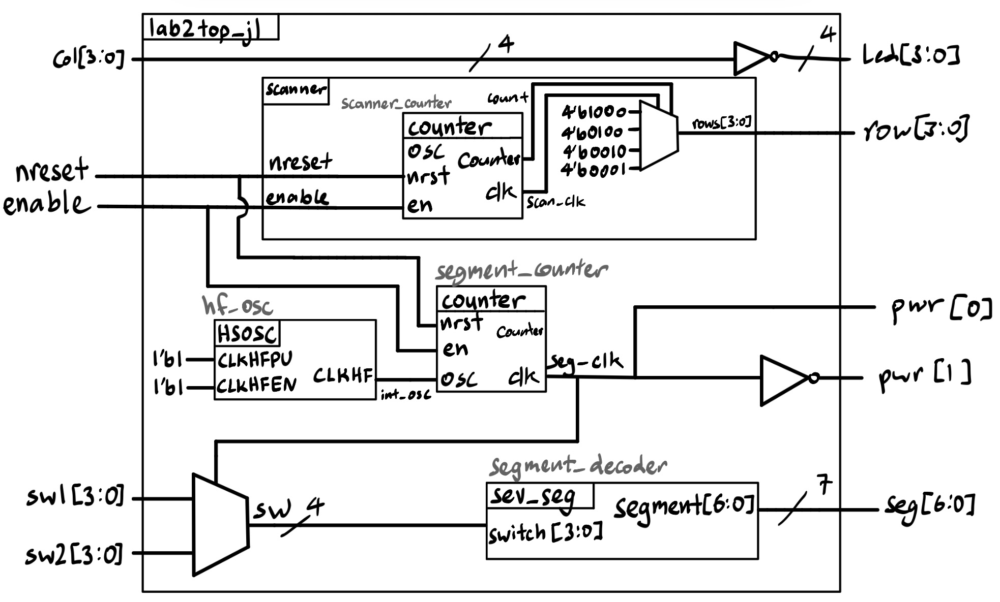
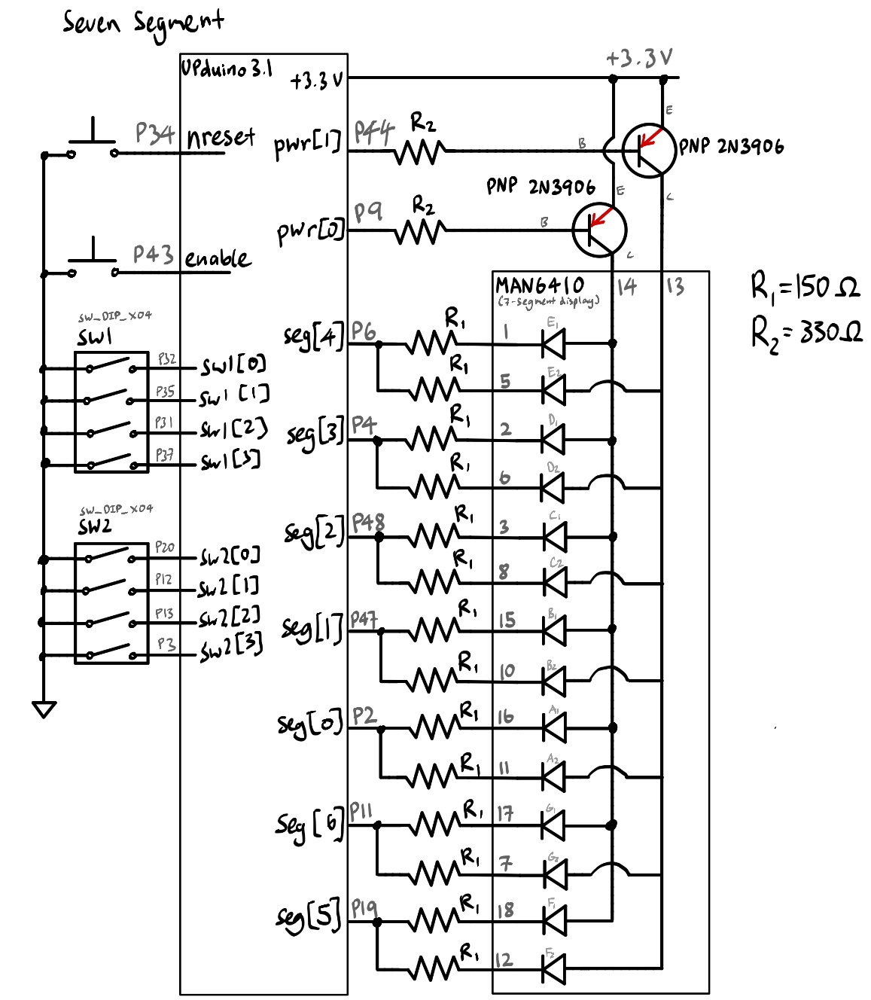
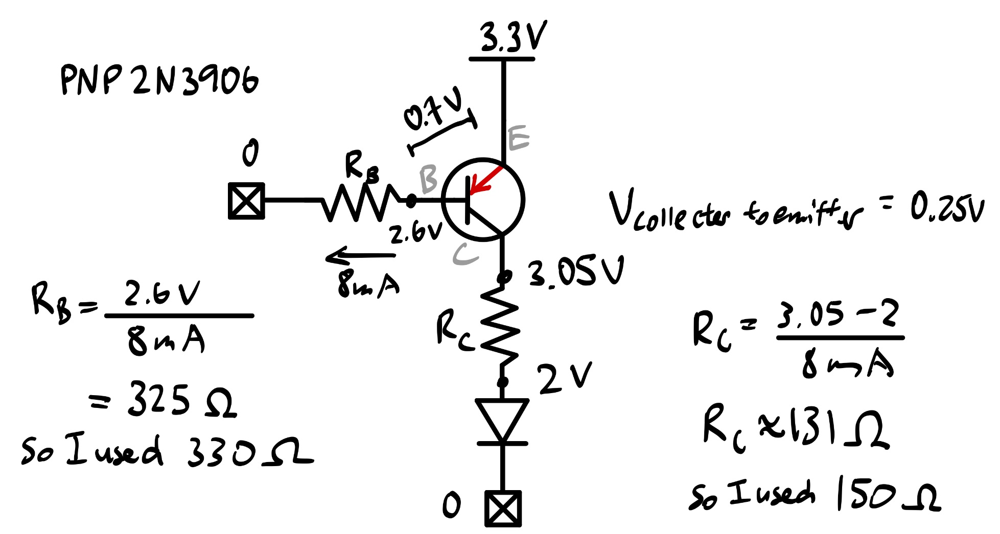
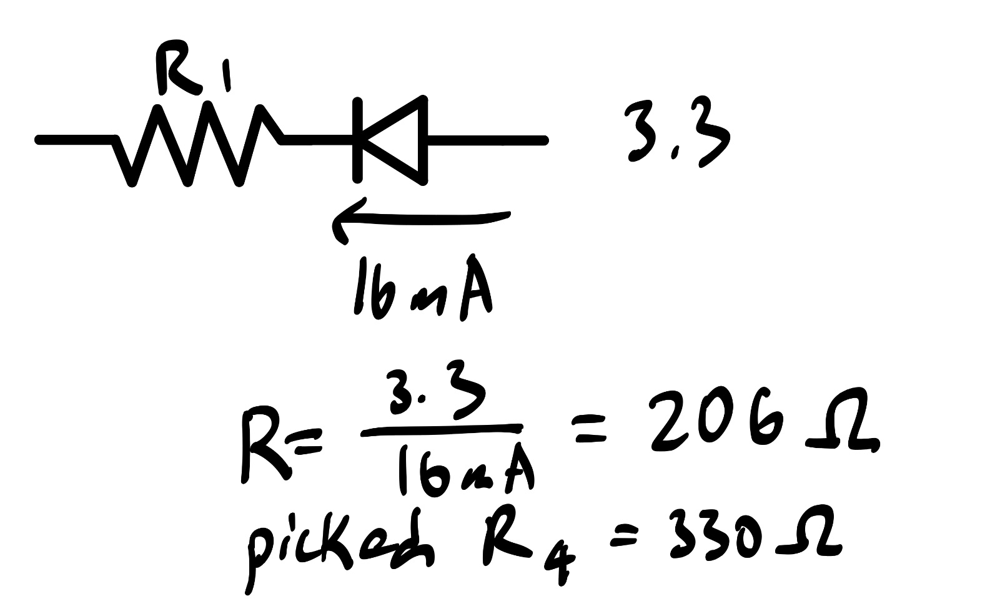
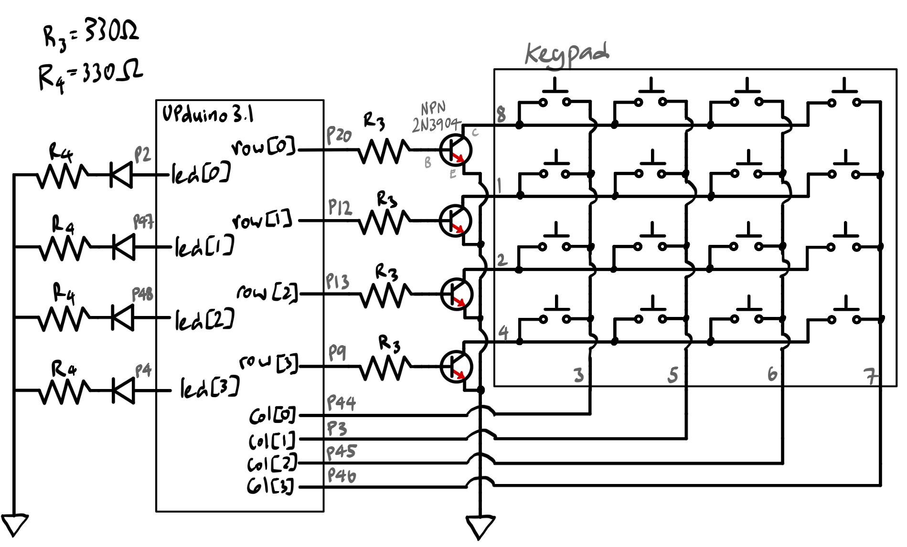
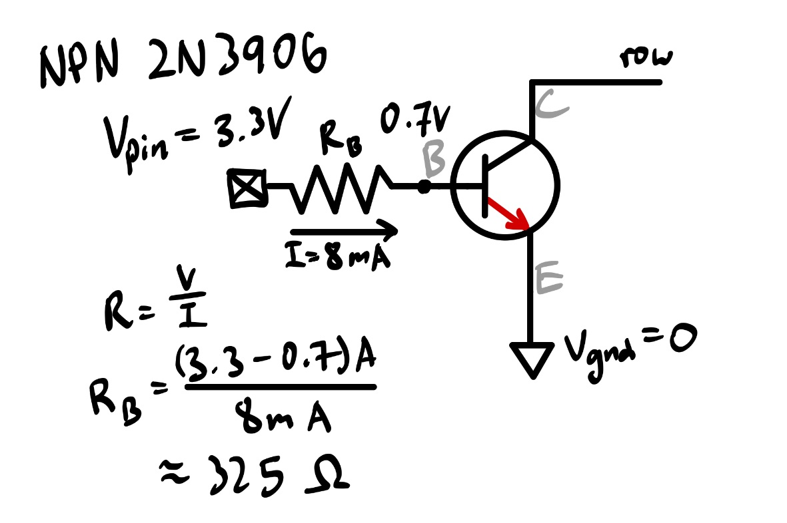
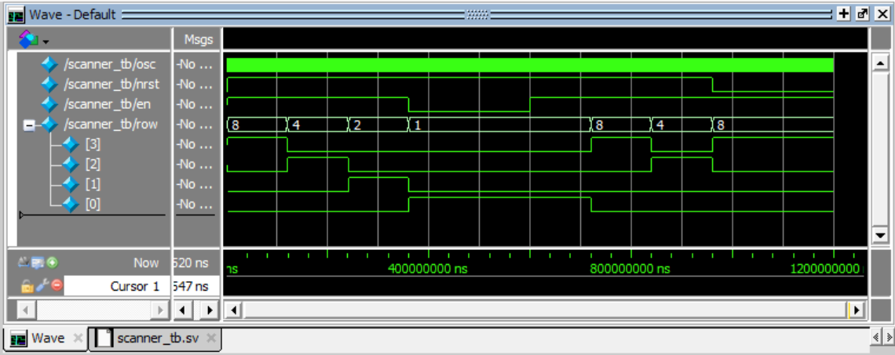
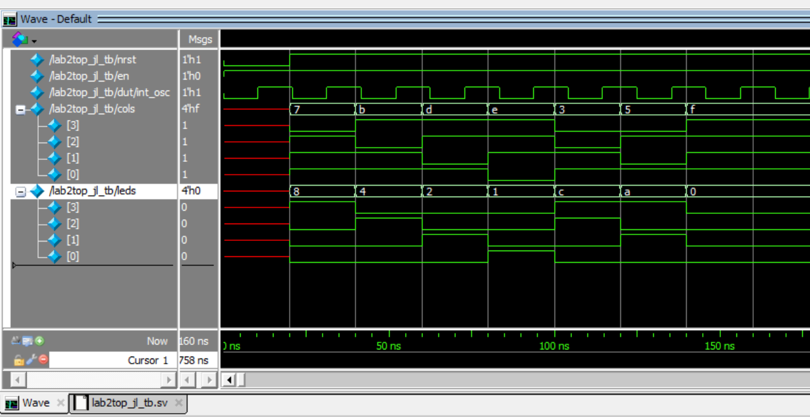
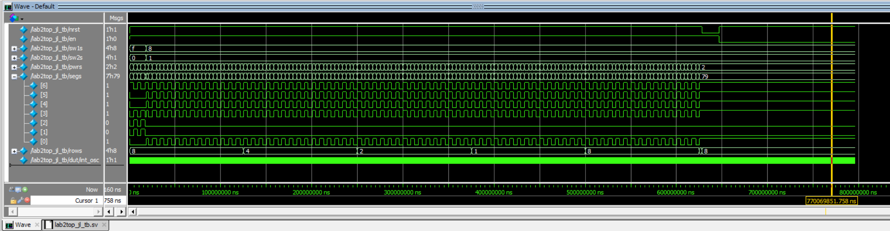

## Introduction

In this lab, a design was implemented on the FPGA with the following features:

* A time-multiplexing scheme to drive two seven-segment displays with a single set of FPGA I/O pins (minimizing hardware).

  - Frequency of display toggling did not result in visual flicker or electronic bleeding.

* Implemented a 4 by 4 keypad and verified that logic signals can pass through it.

  - LEDs were used to help visualize the connections.

* Simple PNP transistor circuits to drive large currents from the FPGA pins, and NPN transistor circuits to implement open-drain/collector output for multiple simultaneous keypad presses.

* Modular Verilog systems

### Video Demos
::: {.callout-note collapse="false"}
## Lab 2: Scanner and Keypad Demo

:::

::: {.callout-note collapse="false"}
## Lab 2: Multiplexed Seven-Segment Display Demo

:::

## Design and Testing Methodology

This project displays two independent hexadecimal numbers on a common-anode dual seven-segment display. Two 4-position DIP switches provide the data for two hexadecimal numbers. Multiplexed operation was implemented
to allow a single seven-segment decoder HDL module to drives the cathodes for both digits on the display. PNP transistors were used to drive large currents from the FPGA output pins to the anode pins on the dual seven-segment display.

This project also implements a 4 by 4 keypad, four rows and four columns, connected to 8 pins. When a key is pressed, 
the corresponding row and column are connected. A four-output scanning circuit was built to rotate between exerting 1000, 0100, 0010, and 0001 such that each bit toggles at a rate of 2 Hz. 
These outputs of the scanning circuit are connected to the rows of the keypad, and the four columns are connected to input pins. The column input pins are read and driven to four external LEDs. The result 
of this arrangement is that a single key press will cause the LED to blink at a rate of 2 Hz, as the row is activated at a rate of 2 Hz. NPN transistors were used to connect the FPGA outputs to the keypad rows to allow for 
multiple simultaneous key presses.

The design uses a total of 4 modules:

1. lab2top_jl (top-level module)

  - This module handled keypad column input to LED output logic, as well as multiplexing logic for the dual seven segment displays. It utilizes the on-board high speed oscillator (`HSOSC`) to generate a signal at 48 MHz, which is 
  divided down by a parameterized instance of the counter submodule to allow for frequency control on the dual seven segment displays. Each display was toggled at a frequency of 120 Hz to avoid visual flicker and electronic bleeding, 
  allowing the use of one set of hardware logic for a single seven segment display to drive two sets of inputs and outputs at once. 
  The top module utilized the following submodules:

2. counter (submodule)
  
  - This submodule is a simple clock divider that converts the 48 Mhz `HSOSC` signal to slower signal (parameterized). Implemented enable and reset.
  - This submodule contains no major changes from Lab 1.

3. sev_seg (submodule)

  - This submodule contained the logic for the switch input to seven segment display output.
  - This submodule contains no major changes from Lab 1.

4. scanner (submodule)

  - This submodule drives a scanner circuit that exerts a 4 bit output that cycles through powering one row of the keypad at a time, at a rate of 2 Hz per row.
  - This submodule contains a separate instance of the counter submodule, parameterized to fit the desired scanning frequency.

Testing simulations (using QuestaSim) were designed and performed thoroughly, results are shown in a following section of this report. No tests were repeated for previously verified modules from Lab 1.

## Technical Documentation:

The source code for the project can be found in the associated [Github repository](https://github.com/jesli12/e155-lab2/tree/main).

### Block Diagram

::: {#fig-block-diagram}
{#fig-block-diagram}

Block diagram of the Verilog design, as described in the Design and Testing Methodology section. 
:::

The block diagram in @fig-block-diagram demonstrates the overall architecture of the design. The top module (lab2top_jl) contains instantiations of the submodules (counter, sev_seg, and scanner). The top module also contains the mux logic for driving the dual seven segment display and the keypad's column input to LED output logic.

### Schematic

The dual seven-segment display circuit was implemented separately from the keypad circuit. The schematic of the physical circuits are shown below.

::: {.callout-note collapse="true"}
## Schematic of the Seven-Segment Display Circuit
{#fig-schematic_sev_seg}

Schematic of the physical dual seven-segment display circuit.
:::

@fig-schematic_sev_seg shows the physical layout of the dual seven-segment display circuit.
Note: Internal 100 k$\Omega$ pullup resistors were used to ensure the active low pins are not floating.

Since the common anode pins from the dual seven-segment display require a large current to drive the display, PNP transistors were used to allow the FPGA output pins to drive the anode pins. The base of each transistor was connected to the FPGA output pin through a 330 $\Omega$ resistor to limit the base current. The collector of each transistor was connected to the common anode pin of each digit on the dual seven-segment display, and the emitter was connected to +3.3 V.

::: {.callout-note collapse="true"}
## Calculations for the Seven-Segment Display Circuit Resistors
{#fig-pnp}

Calculations for the PNP transistors and resistors used in the seven-segment display circuit. 
:::

::: {.callout-note collapse="true"}
## Schematic of the Scanner and Keypad Circuit
{#fig-schematic_scanner}

Schematic of the physical scanner and keypad circuit.
:::

@fig-schematic_scanner shows the physical layout of the scanner and keypad circuit. The scanner circuit is implemented using a 4-bit counter that cycles through the four rows of the keypad at a rate of 2 Hz. The column inputs are connected to four LEDs to visualize which key is pressed.

The matrix keypad is implemented such that signals are asserted to each row one at a time, and the column inputs are read to determine which key is pressed. However, multiple touches on the keypad can result in unusual electrical conditions: pressing two keys in the same column will short two row drivers, which can result in difficult to predict voltages. 

To address this problem NPN transistors were used to create open-drain/collector outputs, which is a type of output driven by the drain/collector of a transistor. When the output is asserted, the transistor will pull down, but when the output is deasserted, the transistor will be off and the output will be floating. This allows multiple outputs to be connected together without shorting them together. To convert the FPGA pin to an open-drain output, the pin drives the base of a transistor and have the emitter connected to ground. 

::: {.callout-note collapse="true"}
## Calculations for Scanner and Keypad Circuit Resistors
{#fig-npn}

Calculations for the NPN transistors and resistors used in the scanner and keypad circuit. 
:::

## Results and Discussion

All specifications were met. Design supported multiple key presses.

Given more time, the circuit breadboard layout could be set up more intentionally to allow for easier visibility of connections. 

### Testbench Simulation

Given that the counter and single seven segment (switch_to_display) submodules were verified thoroughly in Lab 1, the testbenches for this project focused on fucntions that were not covered.

Two testbenches were written, one tested the new scanner module (for the keypad's scanner circuit), and the other tested the top module that implemented all modular functions.

Below are the QuestaSim simulations.

#### Scanner Submodule Tests: scanner.sv

::: {.callout-note collapse="true"}
## Scanner Testbench QuestaSim Results
{#fig-scannertb}

This waveform demonstrates the FPGA 4 pin output that drives power to the keypad, where each row is activated at a rate of 2 Hz. Following the demonstration of cycling through the four configurations of the 
4 bit binary output, the testbench demonstrates the functionality of enable (which holds the current output state) and the active-low reset (which resets the output to state 1, activating row 1).

:::

#### Top Module Tests: lab2top_jl.sv

::: {.callout-note collapse="true"}
## Top Module Testbench QuestaSim Results
{#fig-colToLED}

This waveform demonstrates that the four LED outputs are properly controlled by the column inputs. 

{#fig-toptb}

This waveform demonstrates the multiplexing functionality (for the 7-segment switches and displays), as well as reset and enable functions. (Note that reset is active low.)

:::

## Conclusion

This design successfully implemented a time-multiplexing scheme to drive two seven-segment displays with a single set of FPGA I/O pins (minimizing hardware). A 4 by 4 keypad was also implemented 
and verified that logic signals can pass through it.

I spent roughly a total of 25 hours working on this lab.

## AI Prototype Summary

To explore the capability and usage of AI, the following prompts were entered into Gemini Pro:

::: {.callout-note title="LLM Prompt 1" collapse="true"}
"Write SystemVerilog HDL to time multiplex a single seven segment decoder (that decodes from four bits to a common anode seven segment display) to decode two sets of input bits and drive two sets of seven output bits."
:::

::: {.callout-note collapse="true"}
## AI Prototype Code
  module lab2_ai_proto_no_assist #(
    parameter integer CLK_FREQ_HZ = 50_000_000, // Input clock frequency in Hz
    parameter integer REFRESH_HZ  = 200            // Desired overall refresh rate
)(
    input  logic       clk,         // System clock
    input  logic       rst,         // Active-high asynchronous reset
    input  logic [3:0] in0,         // 4-bit data for Display 0
    input  logic [3:0] in1,         // 4-bit data for Display 1
    output logic [6:0] seg0_n,      // Active-low segment outputs for Display 0 {g,f,e,d,c,b,a}
    output logic [6:0] seg1_n,      // Active-low segment outputs for Display 1 {g,f,e,d,c,b,a}
    output logic       an0,         // Anode control for Display 0 (Active HIGH)
    output logic       an1          // Anode control for Display 1 (Active HIGH)
);

    // Calculate clock division limit for digit toggle (switches at 2 * REFRESH_HZ)
    localparam integer TOGGLE_COUNT = CLK_FREQ_HZ / (REFRESH_HZ * 2);

    logic [$clog2(TOGGLE_COUNT)-1:0] clk_cnt;
    logic                            active_digit; // 0: Display 0, 1: Display 1
    logic [3:0]                      mux_data;
    logic [6:0]                      decoded_seg_n;

    // -------------------------------------------------------------------------
    // 1. Refresh Counter & Digit Select
    // -------------------------------------------------------------------------
    always_ff @(posedge clk or posedge rst) begin
        if (rst) begin
            clk_cnt      <= '0;
            active_digit <= 1'b0;
        end else begin
            if (clk_cnt == TOGGLE_COUNT - 1) begin
                clk_cnt      <= '0;
                active_digit <= ~active_digit;
            end else begin
                clk_cnt <= clk_cnt + 1'b1;
            end
        end
    end

    // -------------------------------------------------------------------------
    // 2. Input Data Multiplexer
    // -------------------------------------------------------------------------
    always_comb begin
        mux_data = active_digit ? in1 : in0;
    end

    // -------------------------------------------------------------------------
    // 3. Shared Hexadecimal to Active-Low 7-Segment Decoder
    // Segments layout: {g, f, e, d, c, b, a}
    // -------------------------------------------------------------------------
    always_comb begin
        case (mux_data)
            4'h0:    decoded_seg_n = 7'b100_0000; // 0
            4'h1:    decoded_seg_n = 7'b111_1001; // 1
            4'h2:    decoded_seg_n = 7'b010_0100; // 2
            4'h3:    decoded_seg_n = 7'b011_0000; // 3
            4'h4:    decoded_seg_n = 7'b001_1001; // 4
            4'h5:    decoded_seg_n = 7'b010_0010; // 5
            4'h6:    decoded_seg_n = 7'b010_0000; // 6
            4'h7:    decoded_seg_n = 7'b111_1000; // 7
            4'h8:    decoded_seg_n = 7'b000_0000; // 8
            4'h9:    decoded_seg_n = 7'b001_0000; // 9
            4'hA:    decoded_seg_n = 7'b000_1000; // A
            4'hB:    decoded_seg_n = 7'b000_0011; // b
            4'hC:    decoded_seg_n = 7'b100_0110; // C
            4'hD:    decoded_seg_n = 7'b010_0001; // d
            4'hE:    decoded_seg_n = 7'b000_0110; // E
            4'hF:    decoded_seg_n = 7'b000_1110; // F
            default: decoded_seg_n = 7'b111_1111; // All OFF
        endcase
    end

    // -------------------------------------------------------------------------
    // 4. Output Demultiplexer & Anode Driving
    // -------------------------------------------------------------------------
    always_comb begin
        if (!active_digit) begin
            // Display 0 Active
            an0     = 1'b1;
            an1     = 1'b0;
            seg0_n  = decoded_seg_n;
            seg1_n  = 7'b111_1111; // Blank Display 1 (High impedance/OFF)
        end else begin
            // Display 1 Active
            an0     = 1'b0;
            an1     = 1'b1;
            seg0_n  = 7'b111_1111; // Blank Display 0 (High impedance/OFF)
            seg1_n  = decoded_seg_n;
        end
    end

endmodule
:::

In comparison, prompt #2 included attachments of the counter submodule and the single seven segment submodule.

::: {.callout-note title="LLM Prompt 2" collapse="true"}
"Write SystemVerilog HDL to time multiplex a single seven segment decoder (that decodes from four bits to a common anode seven segment display) to 
decode two sets of input bits and drive two sets of seven output bits. Use the seven segment decoder and oscillator provided in the attached files."
:::

::: {.callout-note collapse="true"}
## AI Prototype Code
  module lab2_ai_proto2 (
    input  logic       clk,
    input  logic       rst,
    input  logic       en,       // Kept in port list for compatibility
    input  logic [3:0] in0,
    input  logic [3:0] in1,
    output logic [6:0] display0,
    output logic [6:0] display1
);

    logic       select;
    logic [3:0] mux_in;
    logic [6:0] decoded_seg;
    logic       internal_en;

    // Tie enable high internally if port is left unconnected/unused
    assign internal_en = en | 1'b1; 

    // Instantiate oscillator/counter
    counter osc (
        .clk(clk),
        .rst(rst),
        .en(internal_en),
        .led(select)
    );

    // Mux input selection based on counter state
    always_comb begin
        if (select) begin
            mux_in = in1;
        end else begin
            mux_in = in0;
        end
    end

    // Instantiate 7-segment decoder
    sev_seg decoder (
        .switch(mux_in),
        .segment(decoded_seg)
    );

    // Register outputs for display time-multiplexing
    always_ff @(posedge clk) begin
        if (~rst) begin
            display0 <= 7'b1111111; // Off (Common Anode)[cite: 2]
            display1 <= 7'b1111111; // Off (Common Anode)[cite: 2]
        end else begin
            if (select) begin
                display1 <= decoded_seg;
            end else begin
                display0 <= decoded_seg;
            end
        end
    end

endmodule
:::

From the first prompt, which did not include submodule attachments, the code is much harder to read when all logic is implemented in-line. 
There's also an interesting use of always blocks (always_comb and always_ff) instead of assign like I did.

Most of the SystemVerilog syntax I recognize,
but the one thing I didn't recognize was the first output's use of $clog2, a math function that means ceiling of log base 2 (automatically calulcating the number of bits needed). 
I think this makes the code cleaner, especially as some initial bugs I had in the project came from incorrectly setting bit size parameters for my counters.