## Introduction

In this lab, a design was implemented on the FPGA with the following features:

* A time-multiplexing scheme to drive two seven-segment displays with a single set of FPGA I/O pins (minimizing hardware).

  - Frequency of display toggling did not result in visual flicker or electronic bleeding.

* Implemented a 4 by 4 keypad and verified that logic signals can pass through it.

  - pressed numbers displayed on the dual seven segment component.

* Simple PNP transistor circuits to drive large currents from the FPGA pins, and NPN transistor circuits to implement open-drain/collector output for multiple simultaneous keypad presses.

* Modular Verilog systems, communicating FSMs

## Design and Testing Methodology

This project displays two independent hexadecimal numbers on a common-anode dual seven-segment display. Two 4-position DIP switches provide the data for two hexadecimal numbers. Multiplexed operation was implemented
to allow a single seven-segment decoder HDL module to drives the cathodes for both digits on the display. PNP transistors were used to drive large currents from the FPGA output pins to the anode pins on the dual seven-segment display.

This project also implements a 4 by 4 keypad, four rows and four columns, connected to 8 pins. When a key is pressed, 
the corresponding row and column are connected. A four-output scanning circuit was built to rotate between exerting 1000, 0100, 0010, and 0001 such that each bit toggles at a rate of 2 Hz. 
These outputs of the scanning circuit are connected to the rows of the keypad, and the four columns are connected to input pins. The column input pins are read and driven to four external LEDs. The result 
of this arrangement is that a single key press will cause the LED to blink at a rate of 2 Hz, as the row is activated at a rate of 2 Hz. NPN transistors were used to connect the FPGA outputs to the keypad rows to allow for 
multiple simultaneous key presses.

The design uses a total of 9 total modules

Testing simulations (using QuestaSim) were designed and performed thoroughly, results are shown in a following section of this report. No tests were repeated for previously verified modules from Lab 1.

## Technical Documentation:

The source code for the project can be found in the associated [Github repository](https://github.com/jesli12).

### Block Diagram

::: {#fig-block-diagram}
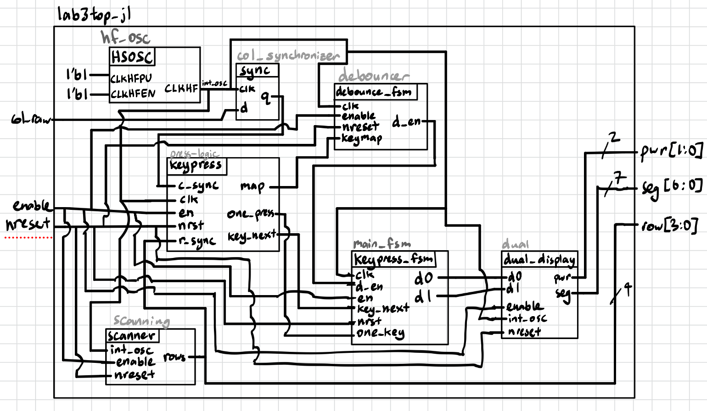{#fig-block-diagram}

Block diagram of the Verilog design, as described in the Design and Testing Methodology section. 
:::

The block diagram in @fig-block-diagram demonstrates the overall architecture of the design. 

### State Transition Diagrams

::: {#fig-state-diagram}
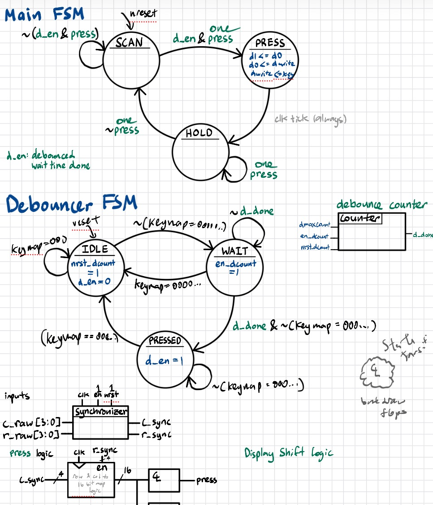{#fig-state-diagram}

:::

### Schematic

The dual seven-segment display circuit was implemented separately from the keypad circuit. The schematic of the physical circuits are shown below.

::: {.callout-note collapse="true"}
## Schematic1
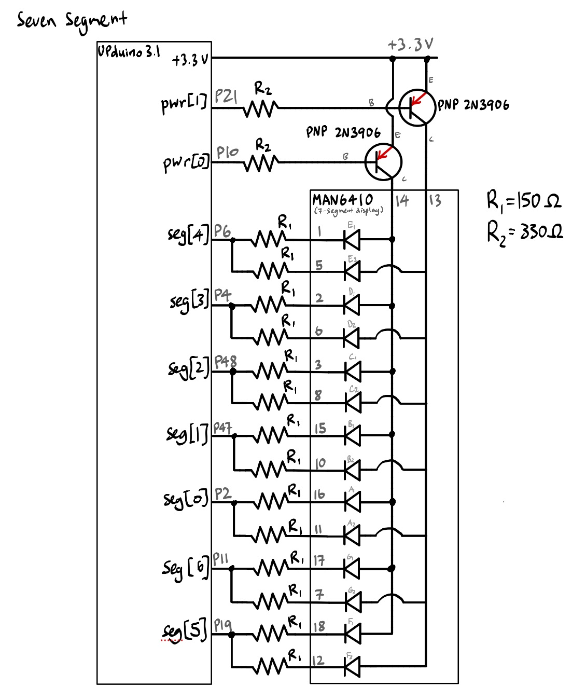{#fig-schematic_1}

Schematic of the physical dual seven-segment display circuit.
:::

::: {.callout-note collapse="true"}
## Schematic2
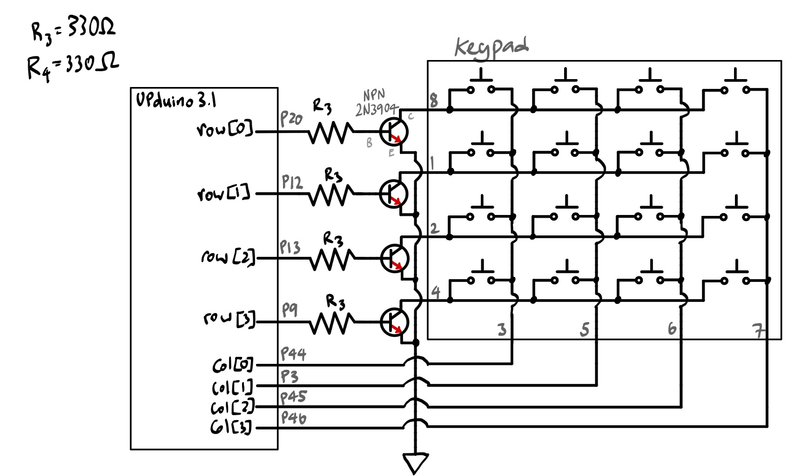{#fig-schematic2}

Schematic of the physical scanner and keypad circuit.
:::

## Results and Discussion

All specifications were met. Design supported multiple key presses.

Given more time, the circuit breadboard layout could be set up more intentionally to allow for easier visibility of connections. 

Documentation I ran out of time for, will update soon in the future more formally.

### Testbench Simulation

Given that the counter and single seven segment (switch_to_display) submodules were verified thoroughly in Lab 1, the testbenches for this project focused on fucntions that were not covered.

Two testbenches were written, one tested the new scanner module (for the keypad's scanner circuit), and the other tested the top module that implemented all modular functions.

Below are the QuestaSim simulations.

#### Scanner Submodule Tests: scanner.sv

::: {.callout-note collapse="true"}
## Scanner Testbench QuestaSim Results
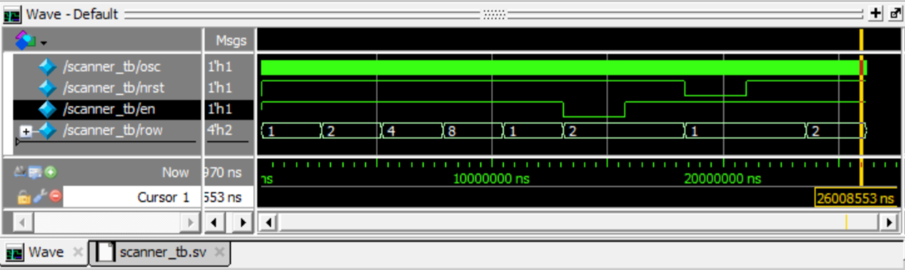{#fig-scanner}

This waveform demonstrates the FPGA 4 pin output that drives power to the keypad, where each row is activated once per cycle. Following the demonstration of cycling through the four configurations of the 
4 bit binary output, the testbench demonstrates the functionality of enable (which holds the current output state) and the active-low reset (which resets the output to state 1, activating row 1).

:::

::: {.callout-note collapse="true"}
## Waveform Testbenches QuestaSim Results
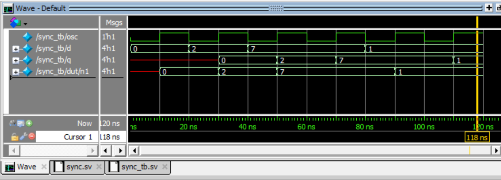

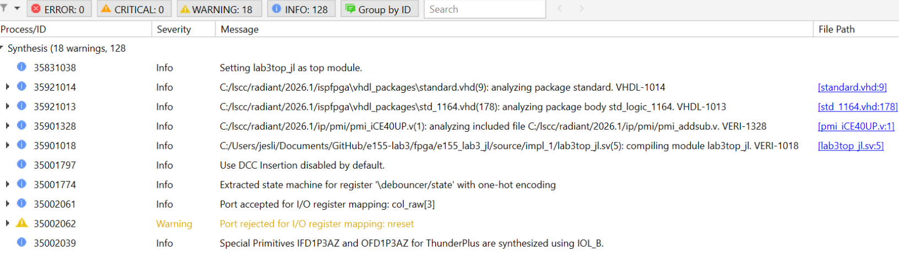

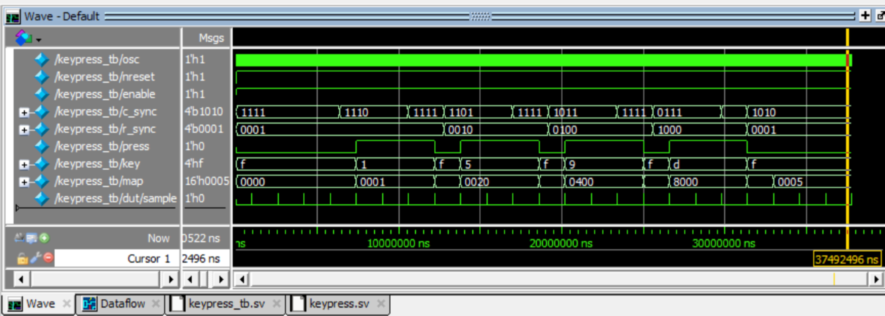

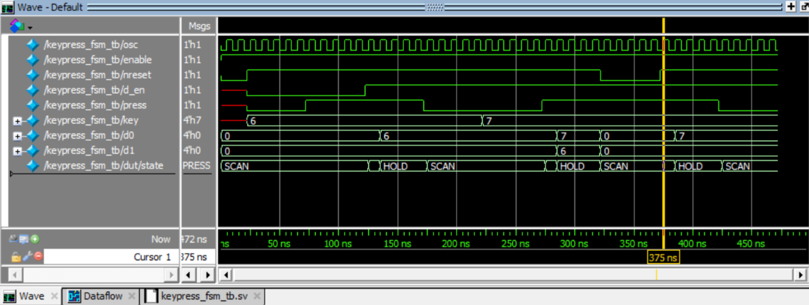

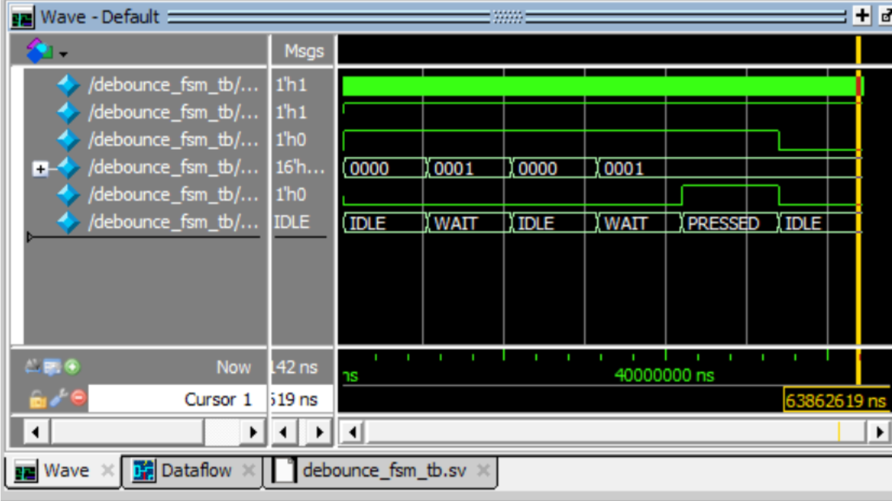
:::

#### Top Module Tests: lab3top_jl.sv

::: {.callout-note collapse="true"}
## Top Module Testbench QuestaSim Results
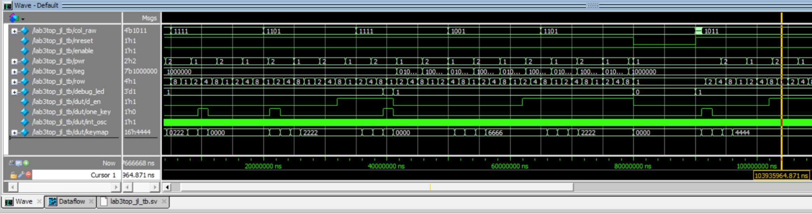{#fig-colToLED}

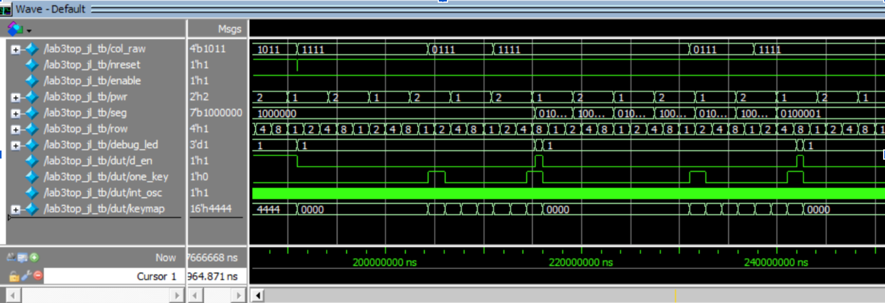{#fig-toptb}

:::

## Conclusion

This design successfully implemented a time-multiplexing scheme to drive two seven-segment displays with a single set of FPGA I/O pins (minimizing hardware). A 4 by 4 keypad was also implemented 
to control the display, successfully dealing with edge case scenarios of multikey pressing and switch bouncing.

I spent roughly a total of 75 hours working on this lab.

## AI Prototype Summary

To explore the capability and usage of AI, the following prompts were entered into Gemini Pro:

::: {.callout-note title="LLM Prompt 1" collapse="true"}
"Write SystemVerilog HDL to time multiplex a single seven segment decoder (that decodes from four bits to a common anode seven segment display) to decode two sets of input bits and drive two sets of seven output bits."
:::

::: {.callout-note collapse="true"}
## AI Prototype Code
  
:::

In comparison, prompt #2 separated prompting by module.

::: {.callout-note title="LLM Prompt 2" collapse="true"}
"Write SystemVerilog HDL to time multiplex a single seven segment decoder (that decodes from four bits to a common anode seven segment display) to 
decode two sets of input bits and drive two sets of seven output bits. Use the seven segment decoder and oscillator provided in the attached files."
:::

::: {.callout-note collapse="true"}

:::

Suprisingly, prompt 2's modules were unable to synthesize while prompt 1 was able to.
