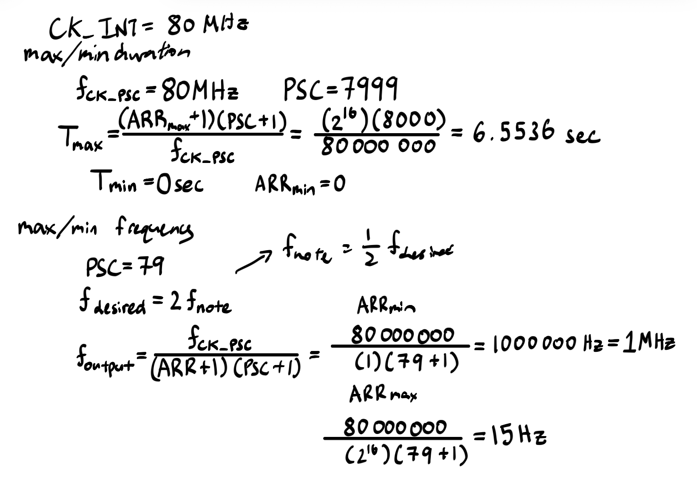
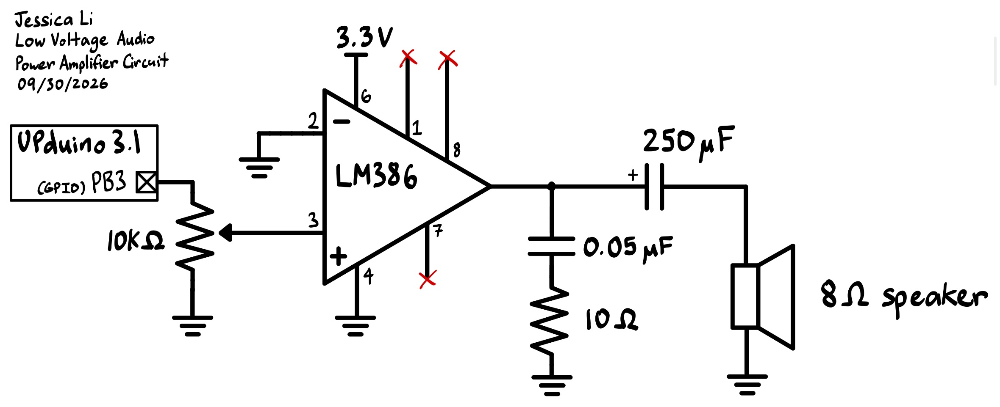

## Introduction

In this lab, a system was built on the MCU to read a list of notes that specifies pitch (Hz) and duration (ms) for each note. It generates a square wave to an output pin, which is connected to a speaker to play music. The code manually defines macros and register structures, as well as manually configures timers and device drivers from scratch (without the CMSIS headers). 

This lab practices understanding an MCU at a register level from navigating the data sheet, programmer's manual, and reference manual. 

## Design and Testing Methodology

::: {.callout-note collapse="true"}
## Max/Min Duration and Frequency Supported Calculations
{#fig-calcs}

Thus, max frequency is 500000 Hz, and minimum is 7.5 Hz (excluding the 0 Hz case).

Note that a frequency of 0 is supported by special case handling.
:::

Find Fur Elise Accuracy calculations [here.] (https://docs.google.com/spreadsheets/d/1u3_AweWqI6BGVOK50YBDLLOC6eYB2ToBYOBJxcAP9Fw/edit?usp=sharing)

## Technical Documentation:

The source code for the project can be found in the associated [Github repository](https://github.com/jesli12/e155_lab4).

### Schematic

An 8 ohm speaker was connected to the MCU to produce sound. To prevent damage to the MCU output pin from excessive current draw of the 8 ohm speaker, a LM386 amplifier was used to buffer the signal and supply sufficient current. 

The schematic of the physical circuits are shown below.

::: {.callout-note collapse="true"}
## Schematic
{#fig-schematic}

Schematic of the physical 8 ohm speaker circuit, based on the 20 gain speaker circuit in the LM386 datasheet.
:::

## Results and Discussion

All specifications were met.

## Conclusion

This project successfully 

I spent roughly a total of 15 hours working on this lab.

## AI Prototype Summary

To explore the capability and usage of AI, the following prompts were entered into Gemini Pro post lab completion:

::: {.callout-note title="LLM Prompts" collapse="true"}
"What timers should I use on the STM32L432KC to generate frequencies ranging from 220Hz to 1kHz? What’s the best choice of timer if I want to easily connect it to a GPIO pin? What formulae are relevant, and what registers need to be set to configure them properly?"
:::

Gemini Pro suggested to use TIM2 (32-bit general-purpose timer) or TIM15 / TIM16 (16-bit general-purpose timers). It mapped out how to configure Timer 2 and use a PWM signal for note frequency, instead of the strategy I implemented of toggling the output pin directly. It was able to call out the relevant formulas for calculating the corret ARR for frequency and duration, as well as the correct registers that need to be set for proper configuration, even without the data sheet uploaded (I attribute this to the fact that STM32s are pretty well documented online).

