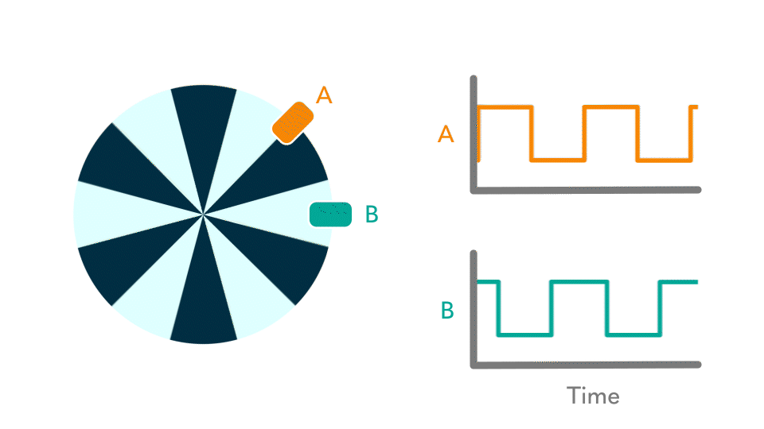
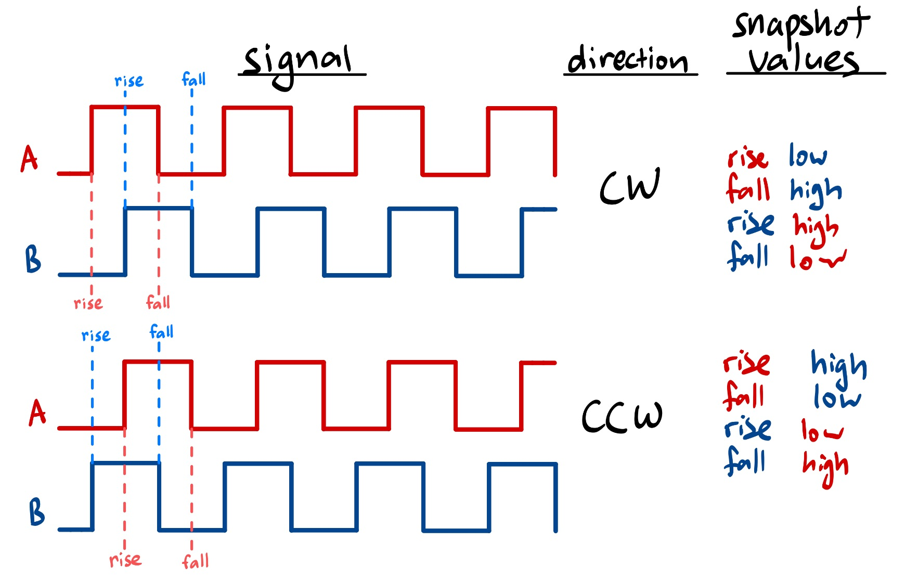
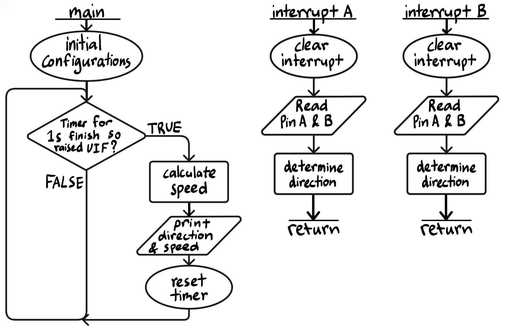
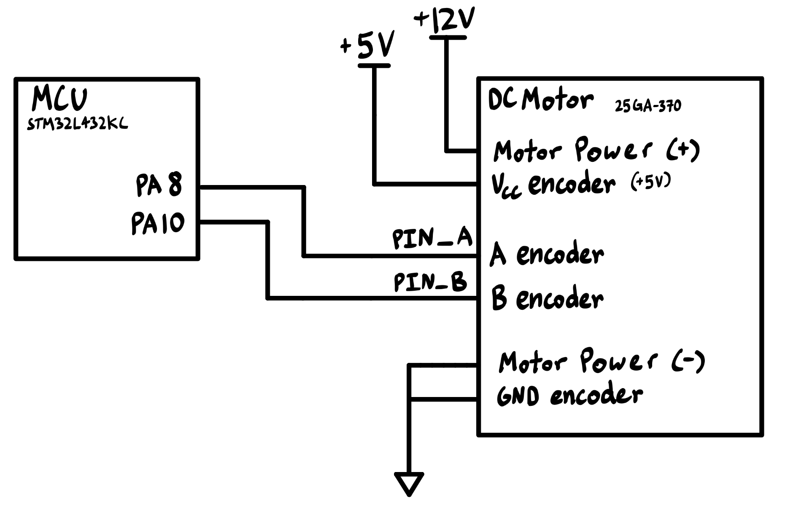

## Introduction
In this project, I use my MCU to determine the velocity of a motor by reading from a quadrature encoder using interrupts.

In summary, in this project, I...

* Implemented an algorithm to sense quadrature encoder pulses and convert those pulses into a motor velocity.

* Written code to display the measured speed and direction to a user with an update rate of at least 1 Hz.

* Understood the quadrature encoder protocol and implemented a multi-interrupt routine on the MCU to interface with it.

::: {.callout-note collapse="true"}
## Background: What is a quadrature encoder?
{#fig-encoder}

Quadrature encoders contain two stationary digital sensors, and a disc that rotates with the motor. The one I worked with in this project used magnets and hall effect sensors to produce signals. The two sensors are 90° degrees out of phase, which provides higher angular resolution and can be used to determine the direction and speed of rotation. 
:::

## Design and Implementation Methodology

### Determining Rotational Direction using 2 Quadrature Encoders
{#fig-direction}
This diagram shows how the two encoder signals would look when the motor is rotating in a clockwise or counter clockwise direction (refer to @fig-encoder for animated visualization). It is important to note that the two sensors are 90° degrees out of phase, thus the signals are shifted accordingly.

The interrupts are set to trigger at the rising and falling edges, with a separate interrupt handler for each sensor (sensor A and sensor B). Once an interrupt triggers, the respective handler runs and determines if it occured on a rising or falling edge, and then determines if the other sensor's signal is high or low. The specific pairing of these two values result in the direction, as depicted in the figure above.

### Calculating Speed using 2 Quadrature Encoders
To calculate the speed of rotation, the total number of edge-triggered interrupts was tracked in a 1 second interval, and then calculated to find the number of revolutions per second.

As a timer counts up to a 1 second interval, a counter is incremented each time an interrupt is triggered for the rising or falling edges of either sensor A or B. This means, for every 1 pulse, 4 interrupts are triggered and as such the counter is incremented 4 times.

The following equation was used to determine the speed:

$speed = count / (4 * ppr)$

Where the pulse per revolution ($ppr$) is given by the motor's datasheet (in this case, it is 408 pulses per revolution). 

Triggering interrupts at the falling and rising edge for both sensors increases accuracy as it divides the time interval of a single pulse into 4, allowing for a higher resolution of measurement.

### Why use interrupts over a polling strategy?

Polling requires the processor to continuously check and monitor the two sensor inputs for rising and falling edges. This can be inefficient when the checks come as blank on higher resolution frequencies, but edges can be misses at lower resolution polling frequencies (signal aliasing). Especially since the motor speed is undetermined and can be varied, a polling strategy can be more difficult to achieve accuracy. Also, this sampling accuracy is significant in a polling strategy because it must be careful about interpreting logic highs and lows as rising or falling edges or if it had just sampled in the middle of a pulse (instead of an edge).

Interrupts must trigger at the edges, and thus if implemented correctly (interrupts are resolved quickly), it would be difficult to miss edge triggers that polling might be subjected to. Using interrupts allow us to be confident that either a rising or falling edge has occured.

::: {.callout-note collapse="true"}
## Polling Inaccuracy Example
For more exploration of why polling might create inaccuracies, let's work through the following scenario. For example, say the motor has 408 pulses per revolution, and the motor spins at 2.5 revolutions a second. This means that for every second, there is 1020 pulses a second. Since we need to count each rising and falling edge, that is 1020*4=4080 counter incrementations in a one second interval (4080 Hz!). This frequency assumes that each sample occurs near a signal edge consistently, so for accurate representation of the readings, a much higher sampling frequency must be chosen. However, this required frequency may change with the rotational speed of the motor, and cause aliasing if it results in undersampling.
:::

## Technical Documentation:

The source code for the project can be found in the associated [Github repository](https://github.com/jesli12/e155-lab5).

### Flowchart

The flowchart below describes the sequence flow of the design.

::: {.callout-note collapse="true"}
## Flowchart
{#fig-flowchart}

Interrupt A is triggered on a signal edge of an input pin A, and Interrupt B is triggered on a signal edge of an input pin B.

A global counter that reset per 1 second cycle is incremented each time an interrupt is triggered, which serves as the tracked number of pulses within the cycle that is used to determine speed.
:::

### Schematic

A DC motor was wired to the MCU, and received 12V power from a external power supply.

::: {.callout-note collapse="true"}
## Schematic
{#fig-schematic}

Schematic of the set up.
:::

## Results and Discussion

All specifications were met.

## Conclusion

This project successfully measured and reported speed [rotations per second] and direction [clockwise and counterclockwise].

I spent roughly a total of 10 hours working on this lab.

## AI Prototype Summary

To explore the capability and usage of AI for writing correct interrupt-driven embedded C, the following prompts were entered into Gemini Pro after the project was completed:

::: {.callout-note title="LLM Prompts" collapse="true"}
"Write me interrupt handlers to interface with a quadrature encoder. I’m using the STM32L432KC, what pins should I connect the encoder to in order to allow it to easily trigger the interrupts?"
:::

[TODO]